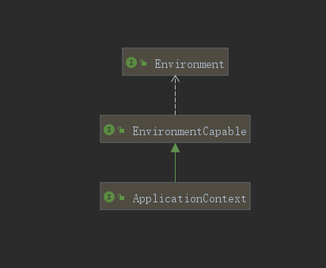
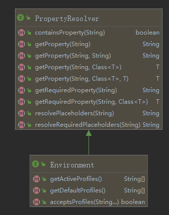

## Environment简介

[TOC]

`Environment是Spring的核心组件之一，可以理解为ApplicationContext的运行时环境，从中我们可以获取操作系统信息、配置文件(application.properties等)中定义的属性信息等。再形象类比的话就是:游戏中的人物信息基础属性(攻击、防御、闪避...)、武器相关属性的获取源头`

### 与ApplicationContext的关系



​	从类图中我们可以看出一个ApplicationContext会关联一个Environment

### Environment概述

​	Environment主要包含两方面的内容



+ Profiles

  ​		通过profile,我们可以给bean设置逻辑命名空间(在类或bean定义中添加@org.springframework.context.annotation.Profile注解)，只有当给定的profile处于active时这些bean才会处于激活状态（通过设置spring.profiles.active）。

  典型应用场景: 

  + 通过profile控制不同环境(开发、测试、生产)中的bean定义

  ```java
  /**
  ** 通过profile控制feign日志的配置
  **/
  @Configuration
  @Profile({"dev","test","local","default"})
  public class FeignConfig {    
      @Bean
      Logger.Level feignLevel() {return Logger.Level.FULL;}
  }
  ```

+ Properties

  ​		从Environment类图中可以看出,此类继承了`PropertyResolver`从而获得了获取属性值相关操作的能力。具体的属性从何而来，那就是`PropertySource`(先占个位 :smiley: )

  

### 应用里如何获取Environment中的property信息

+ 直接通过注入Environment对象进行获取(不推荐)

  我们的Bean可以通过实现org.springframework.context.EnvironmentAware EnvironmentAware或通过注入@Inject Environment的方式获取Environment对象，然后直接调用api的方式获取相关的属性

+ 通过@Value注解的方式获取

  大部分情况下，推荐通过这种对业务无侵入的方式获取属性值

---

接下来: [PropertyResolver、PropertySource的解析]()

