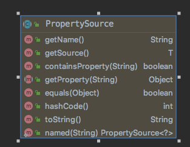
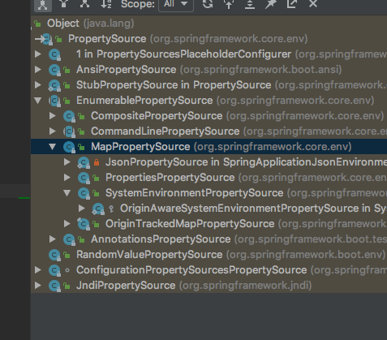

## PropertySource解析

### PropertySource用途

`org.springframework.core.env.PropertySource`顾名思义就是属性源的意思,再具体一点就是对获取键值对资源的抽象类.

从类结构信息可以看出主要包含containesProperty(String),getProperty(String),getName(),getSource()这几个方法，其中通过getSource()获取的source可以是任何封装了属性集的类型(eg:Map,Properties,Redis客户端,Zookeeper客户端等)。再看看PropertySource有哪些实现类，如下图所示:MapPropertySource、PropertiesPropertySource等

但是一般情况下不会单独使用PropertySource，而是通过PropertySources来获取相关属性

### PropertySources

PropertySources聚合了PropertySource,

### PropertySource使用示例

